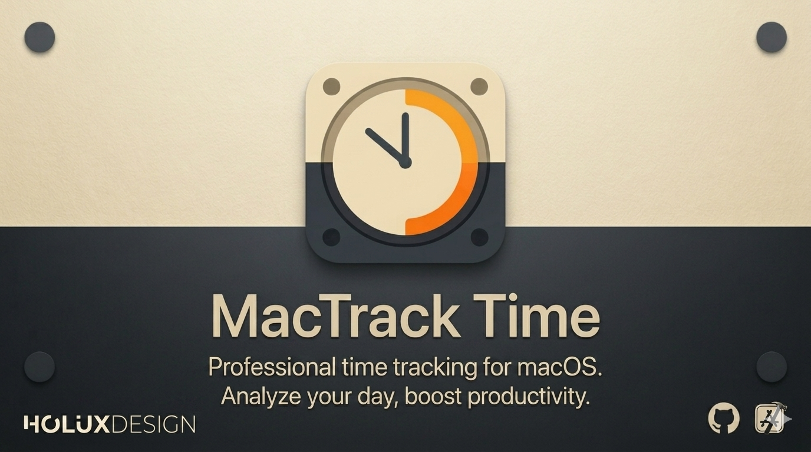

# Mactrack Time



A macOS menu bar app that tracks how you spend time across apps and windows, and assigns it to projects using keyword rules.

## Requirements

- macOS 26.3 or later
- Xcode 26.5 or later (matches the project’s `LastUpgradeCheck`)

## Project layout

```
MacTrack/
├── Config/
│   └── MacTrack.xcconfig      # Signing & bundle ID (edit before first build)
├── MacTrack/
│   ├── App/                   # Entry point, delegate, tracking bootstrap
│   ├── Models/                # SwiftData models
│   ├── Services/              # Tracking engine, projects, settings
│   ├── Views/                 # SwiftUI UI
│   ├── Utilities/             # Helpers
│   ├── Assets.xcassets/
│   └── MacTrack.entitlements
├── MacTrack.xcodeproj/
└── README.md
```

## Getting started in Xcode

### 1. Clone and open

```bash
git clone https://github.com/YOUR_ORG/mactrack-time.git
cd mactrack-time
open MacTrack.xcodeproj
```

Select the **MactrackTime** scheme (shared scheme under `MacTrack.xcodeproj/xcshareddata/xcschemes/`).

### 2. Configure signing (required)

Edit **`Config/MacTrack.xcconfig`** in a text editor or Xcode:

| Setting | What to put |
|--------|-------------|
| `DEVELOPMENT_TEAM` | Your 10-character Apple Developer Team ID. Find it under [Apple Developer → Membership](https://developer.apple.com/account) or in Xcode → **Settings → Accounts** → your team → **Team ID**. Leave empty to sign with a personal Apple ID for local runs only. |
| `PRODUCT_BUNDLE_IDENTIFIER` | A unique reverse-DNS id, e.g. `com.yourname.MactrackTime`. Must not clash with another app on your Mac. |

Optional: create **`Config/MacTrack.local.xcconfig`** (gitignored) to override values without changing the committed file:

```xcconfig
DEVELOPMENT_TEAM = ABCDE12345
PRODUCT_BUNDLE_IDENTIFIER = com.yourname.MactrackTime
```

```xcconfig
// At top of Config/MacTrack.xcconfig (already included in repo):
#include? "MacTrack.local.xcconfig"
```

In Xcode you can also set signing on the **MactrackTime** target → **Signing & Capabilities** → **Team** and **Bundle Identifier**; keep them in sync with `MacTrack.xcconfig` so command-line builds match the IDE.

### 3. Build and run

Press **⌘R**. The app runs as a menu bar accessory (no Dock icon). Use the clock icon in the menu bar to open the popover or main window.

### 4. Grant privacy permissions

On first run, allow:

- **Accessibility** — read focused window titles via the accessibility API  
- **Screen Recording** — fallback for apps that do not expose titles via accessibility alone  

Use **Open Settings** in the menu bar popover if either permission is missing.

## What is not in the repo

- Apple Developer Team IDs or personal bundle IDs  
- `xcuserdata/` (per-user Xcode state)  
- Build products (`DerivedData/`, `build/`)  
- Local config overrides (`Config/MacTrack.local.xcconfig`)  
- Time-tracking data (stored locally by SwiftData in your user Library after you run the app)

## Publishing your own fork

Before pushing to a public remote, check that you are not committing:

- Personal emails or credentials in git config (use `git config --local` only; never commit `.git/config`)  
- Custom bundle IDs or team IDs in source — use `Config/MacTrack.xcconfig` or `MacTrack.local.xcconfig` instead  

## License

MIT — see [LICENSE](LICENSE).
